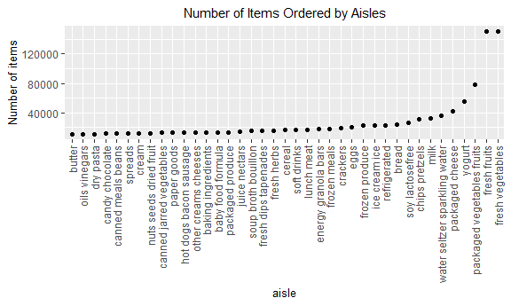
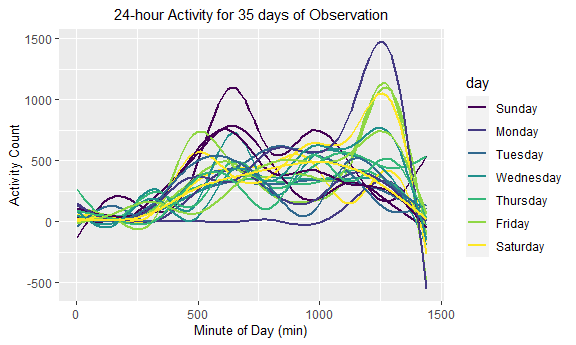

Homework 3
================

Hannah Briggs (heb2133)

``` r
library(tidyverse)
```

    ## -- Attaching packages ---------------------------------- tidyverse 1.3.0 --

    ## v ggplot2 3.3.2     v purrr   0.3.4
    ## v tibble  3.0.3     v dplyr   1.0.2
    ## v tidyr   1.1.2     v stringr 1.4.0
    ## v readr   1.3.1     v forcats 0.5.0

    ## -- Conflicts ------------------------------------- tidyverse_conflicts() --
    ## x dplyr::filter() masks stats::filter()
    ## x dplyr::lag()    masks stats::lag()

``` r
library(patchwork)

knitr::opts_chunk$set(
  fig.width = 6, 
  fig.asp = 0.6,
  out.width = "90%"
)
```

## Problem 1

Load Instacart dataset.

``` r
library(p8105.datasets)
data("instacart")
```

This is an online grocery shopping (Instacart) dataset, that can be used
to explore trends in purchases. It contains 1384617 rows and 15 columns.
Observations are the level of items in orders by customer (i.e., user).
There are customer(user)/order variables – user ID, order ID, order day,
order hour, and days since prior order. In addition, there are item
variables – product ID, product name, aisle name, aisle ID, department
name, and department ID.

Looking at aisles in dataset:

``` r
instacart %>% 
  count(aisle) %>% 
  arrange(desc(n))
```

    ## # A tibble: 134 x 2
    ##    aisle                              n
    ##    <chr>                          <int>
    ##  1 fresh vegetables              150609
    ##  2 fresh fruits                  150473
    ##  3 packaged vegetables fruits     78493
    ##  4 yogurt                         55240
    ##  5 packaged cheese                41699
    ##  6 water seltzer sparkling water  36617
    ##  7 milk                           32644
    ##  8 chips pretzels                 31269
    ##  9 soy lactosefree                26240
    ## 10 bread                          23635
    ## # ... with 124 more rows

There are 134 aisles in the dataset. The top five aisles where the most
items are ordered from are: Fresh vegetables (150,609); Fresh Fruits
(150,473); Packaged vegetables fruits (78,493); Yogurt (55,240); and
Packaged cheese (41,699).

Plot showing number of items ordered in each aisle (limited to aisles
with \> 10000 items ordered):

``` r
instacart %>% 
  count(aisle) %>%
  filter(n > 10000) %>% 
  mutate(
    aisle = factor(aisle),
    aisle = fct_reorder(aisle, n)
  ) %>% 
  ggplot(aes(x = aisle, y = n)) +
  geom_point() +
  labs(
    title = "Number of Items Ordered by Aisles",
    y = "Number of items",
    capion = "Only shows aisles with over 1000 items ordered"
  )
```



``` r
  theme(
    axis.text.x = element_text(angle = 270, vjust = 0.5, hjust = 1), 
    plot.title = element_text(hjust = 0.5, size = 11),
    axis.title = element_text(size = 10),
  )
```

    ## List of 3
    ##  $ axis.title :List of 11
    ##   ..$ family       : NULL
    ##   ..$ face         : NULL
    ##   ..$ colour       : NULL
    ##   ..$ size         : num 10
    ##   ..$ hjust        : NULL
    ##   ..$ vjust        : NULL
    ##   ..$ angle        : NULL
    ##   ..$ lineheight   : NULL
    ##   ..$ margin       : NULL
    ##   ..$ debug        : NULL
    ##   ..$ inherit.blank: logi FALSE
    ##   ..- attr(*, "class")= chr [1:2] "element_text" "element"
    ##  $ axis.text.x:List of 11
    ##   ..$ family       : NULL
    ##   ..$ face         : NULL
    ##   ..$ colour       : NULL
    ##   ..$ size         : NULL
    ##   ..$ hjust        : num 1
    ##   ..$ vjust        : num 0.5
    ##   ..$ angle        : num 270
    ##   ..$ lineheight   : NULL
    ##   ..$ margin       : NULL
    ##   ..$ debug        : NULL
    ##   ..$ inherit.blank: logi FALSE
    ##   ..- attr(*, "class")= chr [1:2] "element_text" "element"
    ##  $ plot.title :List of 11
    ##   ..$ family       : NULL
    ##   ..$ face         : NULL
    ##   ..$ colour       : NULL
    ##   ..$ size         : num 11
    ##   ..$ hjust        : num 0.5
    ##   ..$ vjust        : NULL
    ##   ..$ angle        : NULL
    ##   ..$ lineheight   : NULL
    ##   ..$ margin       : NULL
    ##   ..$ debug        : NULL
    ##   ..$ inherit.blank: logi FALSE
    ##   ..- attr(*, "class")= chr [1:2] "element_text" "element"
    ##  - attr(*, "class")= chr [1:2] "theme" "gg"
    ##  - attr(*, "complete")= logi FALSE
    ##  - attr(*, "validate")= logi TRUE

Table showing the three most popular items in each of the aisles “baking
ingredients”, “dog food care”, and “packaged vegetables fruits”:

``` r
instacart %>% 
  filter(aisle %in%  c("baking ingredients", "dog food care", "packaged vegetables fruits")) %>% 
  group_by(aisle) %>% 
  count(product_name) %>% 
  mutate(rank = min_rank(desc(n))) %>% 
  #Get a ranking for items ordered
  filter(rank < 4) %>% 
  #Get the 3 most popular items
  arrange(aisle, rank) %>% 
  knitr::kable()
```

| aisle                      | product\_name                                 |    n | rank |
| :------------------------- | :-------------------------------------------- | ---: | ---: |
| baking ingredients         | Light Brown Sugar                             |  499 |    1 |
| baking ingredients         | Pure Baking Soda                              |  387 |    2 |
| baking ingredients         | Cane Sugar                                    |  336 |    3 |
| dog food care              | Snack Sticks Chicken & Rice Recipe Dog Treats |   30 |    1 |
| dog food care              | Organix Chicken & Brown Rice Recipe           |   28 |    2 |
| dog food care              | Small Dog Biscuits                            |   26 |    3 |
| packaged vegetables fruits | Organic Baby Spinach                          | 9784 |    1 |
| packaged vegetables fruits | Organic Raspberries                           | 5546 |    2 |
| packaged vegetables fruits | Organic Blueberries                           | 4966 |    3 |

Table showing the mean hour of the day at which Pink Lady Apples and
Coffee Ice Cream are ordered on each day of the week:

``` r
instacart %>% 
  filter(product_name %in% c("Pink Lady Apples", "Coffee Ice Cream")) %>%
  group_by(product_name, order_dow) %>% 
  summarize(mean_hour = mean(order_hour_of_day)) %>% 
  pivot_wider(
    names_from = order_dow, 
    values_from = mean_hour
  ) %>% 
  rename(
    "sunday" = "0",
    "monday" = "1",
    "tuesday" = "2",
    "wednesday" = "3",
    "thursday" = "4",
    "friday" = "5",
    "saturday" = "6"
  ) %>% 
  knitr::kable()
```

    ## `summarise()` regrouping output by 'product_name' (override with `.groups` argument)

| product\_name    |   sunday |   monday |  tuesday | wednesday | thursday |   friday | saturday |
| :--------------- | -------: | -------: | -------: | --------: | -------: | -------: | -------: |
| Coffee Ice Cream | 13.77419 | 14.31579 | 15.38095 |  15.31818 | 15.21739 | 12.26316 | 13.83333 |
| Pink Lady Apples | 13.44118 | 11.36000 | 11.70213 |  14.25000 | 11.55172 | 12.78431 | 11.93750 |

## Problem 2

Load and tidy accelerometer dataset:

``` r
accel_df = 
  read.csv("./data/accel_data.csv") %>%
  janitor::clean_names() %>% 
  pivot_longer(
    activity_1:activity_1440,
    names_to = "minute",
    names_prefix = "activity_",
    values_to = "activity_count"
  ) %>% 
  mutate(
    day = factor(day),
    minute = as.numeric(minute),
    weekday_or_weekend = recode(day, 
                             "Monday" = "weekday",
                             "Tuesday" = "weekday",
                             "Wednesday" = "weekday",
                             "Thursday" = "weekday",
                             "Friday" = "weekday",
                             "Saturday" = "weekend",
                             "Sunday" = "weekend")
  ) %>% 
  rename("day_of_observation" = "day_id")
```

This dataset is generated from an accelerometer measuring the daily
activity (i.e., activity measured for each minute of the day) of a 63
year-old male cardiac patient for a period of 5 weeks. Variables include
week number (1-5), number of days into observation (1-35), day of the
week, minute of the day, activity count, and whether observation is on a
weekday or weekend. There are 50400 rows and 6 columns in this dataset.

Trends of daily activity over five weeks:

``` r
accel_df %>% 
  mutate(
    day = factor(day),
    day = forcats::fct_relevel(day, c("Sunday",
                                       "Monday", 
                                       "Tuesday", 
                                       "Wednesday",
                                       "Thursday",
                                       "Friday",
                                       "Saturday"))
  ) %>% 
  group_by(week, day) %>% 
  summarize(daily_activity = sum(activity_count)) %>% 
  knitr::kable()
```

    ## `summarise()` regrouping output by 'week' (override with `.groups` argument)

| week | day       | daily\_activity |
| ---: | :-------- | --------------: |
|    1 | Sunday    |       631105.00 |
|    1 | Monday    |        78828.07 |
|    1 | Tuesday   |       307094.24 |
|    1 | Wednesday |       340115.01 |
|    1 | Thursday  |       355923.64 |
|    1 | Friday    |       480542.62 |
|    1 | Saturday  |       376254.00 |
|    2 | Sunday    |       422018.00 |
|    2 | Monday    |       295431.00 |
|    2 | Tuesday   |       423245.00 |
|    2 | Wednesday |       440962.00 |
|    2 | Thursday  |       474048.00 |
|    2 | Friday    |       568839.00 |
|    2 | Saturday  |       607175.00 |
|    3 | Sunday    |       467052.00 |
|    3 | Monday    |       685910.00 |
|    3 | Tuesday   |       381507.00 |
|    3 | Wednesday |       468869.00 |
|    3 | Thursday  |       371230.00 |
|    3 | Friday    |       467420.00 |
|    3 | Saturday  |       382928.00 |
|    4 | Sunday    |       260617.00 |
|    4 | Monday    |       409450.00 |
|    4 | Tuesday   |       319568.00 |
|    4 | Wednesday |       434460.00 |
|    4 | Thursday  |       340291.00 |
|    4 | Friday    |       154049.00 |
|    4 | Saturday  |         1440.00 |
|    5 | Sunday    |       138421.00 |
|    5 | Monday    |       389080.00 |
|    5 | Tuesday   |       367824.00 |
|    5 | Wednesday |       445366.00 |
|    5 | Thursday  |       549658.00 |
|    5 | Friday    |       620860.00 |
|    5 | Saturday  |         1440.00 |

Looking at this table we can observe potential trends in the patient’s
activity over the 5 weeks. The patient’s activity on weekends seems to
decline over time. For example: His daily activity counts in Week 1 for
Saturday (376,254.0) and Sunday (631,105.0); compared to week 5 Saturday
(1,440.0) and Sunday (138,421.0). His activity, on average, is lower in
the last two weeks of observation, and was highest in the 2nd and 3rd
weeks of observation.

Plot of 24-hour activity for all 35 days of observation:

``` r
accel_week1 =
  accel_df %>% 
    mutate(
    day = factor(day),
    day = forcats::fct_relevel(day, c("Sunday",
                                       "Monday", 
                                       "Tuesday", 
                                       "Wednesday",
                                       "Thursday",
                                       "Friday",
                                       "Saturday"))
  ) %>% 
  filter(week == 1)

accel_week2 = 
  accel_df %>% 
    mutate(
    day = factor(day),
    day = forcats::fct_relevel(day, c("Sunday",
                                       "Monday", 
                                       "Tuesday", 
                                       "Wednesday",
                                       "Thursday",
                                       "Friday",
                                       "Saturday"))
  ) %>% 
  filter(week == 2)

accel_week3 = 
  accel_df %>% 
    mutate(
    day = factor(day),
    day = forcats::fct_relevel(day, c("Sunday",
                                       "Monday", 
                                       "Tuesday", 
                                       "Wednesday",
                                       "Thursday",
                                       "Friday",
                                       "Saturday"))
  ) %>% 
  filter(week == 3)

accel_week4 = 
  accel_df %>% 
    mutate(
    day = factor(day),
    day = forcats::fct_relevel(day, c("Sunday",
                                       "Monday", 
                                       "Tuesday", 
                                       "Wednesday",
                                       "Thursday",
                                       "Friday",
                                       "Saturday"))
  ) %>% 
  filter(week == 4)

accel_week5 = 
  accel_df %>%
    mutate(
    day = factor(day),
    day = forcats::fct_relevel(day, c("Sunday",
                                       "Monday", 
                                       "Tuesday", 
                                       "Wednesday",
                                       "Thursday",
                                       "Friday",
                                       "Saturday"))
  ) %>% 
  filter(week == 5)

#Creating complete plot for all 5 weeks
ggplot(data = accel_week1,
  aes(x = minute, y = activity_count, color = day)) +
  geom_smooth(se = FALSE) + 
  geom_smooth(data = accel_week2, se = FALSE) +
  geom_smooth(data = accel_week3, se = FALSE) +
  geom_smooth(data = accel_week4, se = FALSE) +
  geom_smooth(data = accel_week5, se = FALSE) +
  viridis::scale_color_viridis(
    name = "day",
    discrete = TRUE
    ) +
  labs(
    title = "24-hour Activity for 35 days of Observation", 
    y = "Activity Count",
    x = "Minute of Day (min)"
    ) +
  theme(plot.title = element_text(hjust = 0.5, size = 11),
        axis.title = element_text(size = 10)
        )
```

    ## `geom_smooth()` using method = 'gam' and formula 'y ~ s(x, bs = "cs")'
    ## `geom_smooth()` using method = 'gam' and formula 'y ~ s(x, bs = "cs")'
    ## `geom_smooth()` using method = 'gam' and formula 'y ~ s(x, bs = "cs")'
    ## `geom_smooth()` using method = 'gam' and formula 'y ~ s(x, bs = "cs")'

    ## Warning: Computation failed in `stat_smooth()`:
    ## NA/NaN/Inf in foreign function call (arg 3)

    ## `geom_smooth()` using method = 'gam' and formula 'y ~ s(x, bs = "cs")'

    ## Warning: Computation failed in `stat_smooth()`:
    ## NA/NaN/Inf in foreign function call (arg 3)



From this plot we can see that daily activity tends to peak roughly
around 600-650 minutes, and minute 1250 of the day. This equates to
activity peaks around roughly 10am, and 9pm. Meaning that in the
early/late afternoon, the patient tends to be less active and relatively
sedentary compared to the rest of the daytime.

## Problem 3

Load NY NOAA dataset.

``` r
library(p8105.datasets)
data("ny_noaa")
```

Looking at missing data:

``` r
colSums(is.na(ny_noaa))
```

    ##      id    date    prcp    snow    snwd    tmax    tmin 
    ##       0       0  145838  381221  591786 1134358 1134420

This dataset is from the NOAA National Climatic Data Center, containing
data from NY state weather stations from January 1981 to December 2010.
There are 2595176 rows and 7 columns in this dataset. Variables include,
weather station ID, date, precipitation, snowfall and snow depth, and
the max and min temperature. There are 747 distinct weather stations in
this dataset.

The dataset is missing data for key variables to a fair extent (number
observations = na): snowfall (381,221), snowdepth (591,786),
precipitation (145,838), tmin (1,134,420), and tmax (1,460,756).

Tidying NYC NOAA dataset:

``` r
ny_noaa_clean = 
  ny_noaa %>% 
  separate(date, c("year", "month", "day")) %>% 
  mutate(year = as.numeric(year), 
         day = as.numeric(day),
         month = recode(month, 
                        "01" = "january", 
                        "02" = "february",
                        "03" = "march",
                        "04" = "april",
                        "05" = "may",
                        "06" = "june",
                        "07" = "july",
                        "08" = "august",
                        "09" = "september",
                        "10" = "october",
                        "11" = "november",
                        "12" = "december")
         ) %>% 
  #Converting tmin, tmax, and precipitation to reasonable units
  mutate(
    tmin = as.numeric(tmin),
    tmin = tmin/10,
    tmax = as.numeric(tmax),
    tmax = tmax/10,
    prcp = prcp/10
  ) 
```

Most commonly observed values for snowfall:

``` r
ny_noaa_clean %>%
  count(snow) %>% 
  arrange(desc(n))
```

    ## # A tibble: 282 x 2
    ##     snow       n
    ##    <int>   <int>
    ##  1     0 2008508
    ##  2    NA  381221
    ##  3    25   31022
    ##  4    13   23095
    ##  5    51   18274
    ##  6    76   10173
    ##  7     8    9962
    ##  8     5    9748
    ##  9    38    9197
    ## 10     3    8790
    ## # ... with 272 more rows

The five most commonly observed values for snowfall are (obs =
observations): 0 mm (2,008,508 obs), NA i.e., missing (381,221), 25 mm
(31,022 obs), 13mm (23,095 obs), and 51mm (18,274 obs). The most
commonly observed value for snow is 0mm and this makes sense because
this data is collected year round, and for most of the year, NY does not
have snow.

Plot average max temperature in January and July for each station across
the years

``` r
ny_noaa_clean %>% 
  filter(month %in% c("january", "july")) %>%
  na.omit(tmax) %>% 
  group_by(id, year, month) %>% 
  summarize(
    avg_tmax = mean(tmax)
    ) %>% 
  ggplot(aes(x = year, y = avg_tmax, color = id)) + 
  geom_point(alpha = 0.2) +
  geom_smooth(se = FALSE, color = "black") +
  facet_grid(. ~ month) + 
  labs(
    title = "Avg Max Temp from NY Weather Stations during January vs July across Years", 
    y = "Avg Max Temperature (C)",
    x = "Year",
    caption = "Observations colored by 747 weather stations; legend not shown"
    ) + 
  theme(panel.spacing = unit(1.2, "lines"), 
        plot.title = element_text(hjust = 0.5, size = 12),
        axis.title = element_text(size = 11), 
        legend.position = "none"
        )
```

    ## `summarise()` regrouping output by 'id', 'year' (override with `.groups` argument)

    ## `geom_smooth()` using method = 'gam' and formula 'y ~ s(x, bs = "cs")'


This pot demonstrates that on average the max temp is higher during the
month of July. Over the years, the max temp during July looks relatively
stabe. The max temp during January seems to be more varied across the
years. There are some outliers in these graphs from reports from weather
stations.

Two-panel plot showing (i) tmax vs tmin for the full dataset; and (ii)
the distribution of snowfall values \>0 and \<100 by year.

Making the temperature plot:

``` r
temp_plot = 
  ny_noaa_clean %>% 
  na.omit(tmin, tmax) %>% 
  pivot_longer(
    tmin:tmax, 
    names_to = "tmin_vs_tmax",
    values_to = "temperature"
  ) %>% 
  ggplot(aes(x = temperature, fill = tmin_vs_tmax)) +
  geom_density(alpha = 0.4) +
  labs(title = "Min versus Max Temp in NY",
       x = "Temperature (C)") + 
  theme(
    plot.title = element_text(hjust = 0.5, size = 11),
    axis.title = element_text(size = 10),
    legend.title = element_text(size = 10)
  )
```

Making snowfall plot:

``` r
snowfall_plot = 
  ny_noaa_clean %>% 
  filter(snow > 0, snow < 100) %>% 
  ggplot(aes(x = year, y = snow, color = year)) +
  geom_boxplot(aes(group = year)) +
  labs(
    title = "Reports of Snowfall from NY Weather Stations by Year",
    y = "Snowfall (mm)"
  ) + 
  theme(
    plot.title = element_text(hjust = 0.5, size = 11),
    axis.title = element_text(size = 10),
    legend.position = "none"
        )
```

Patching our temperature and snowfall plots together:

``` r
temp_plot / snowfall_plot
```


